# 요즘 LLM에 대한 이슈
- [Reflection](https://blog.langchain.dev/reflection-agents/) : [[실습예제]](https://github.com/langchain-ai/langgraph/blob/main/examples/reflection/reflection.ipynb?ref=blog.langchain.dev)

> ❓Transformer가 뭐지?
> - https://blog-ko.superb-ai.com/what-is-the-transformer-model/

- [BDI(Belief, Desire, Intention)](https://gama-platform.org/wiki/BDIAgents_step2)
    - 점점 철학적인 주제로 논의가 이동하고 있음

---

# 컴퓨터 프로그램의 발전 방향성
- 수학적 기호 -> 자연어(NLP)로 발전
- 함수형 언어(python) -> Prompt!


> **💡Prompt?** 
> - 주로 컴퓨터나 인공지능 모델에게 지시하거나 질문하는 텍스트를 의미
> - 직접 작업에 대해 상세히 코드로 표현하는 것이 아닌, 텍스트로 표현!

#### 함수형 언어란?
- 대표적 함수형 언어: Python

<mark>데이터 구조에 함수를 붙인 것</mark>이 함수형 언어의 철학

- 데이터 타입 (abstract data type)
    - `[]` : list
    - `()` : tuple
    - `{}` : map

 **데이터 구조에 `.`을 찍으면 함수가 존재한다.**
```python
foo = [3, 1, 2] # 리스트 타입의 데이터 구조
print(foo) # [3, 1, 2]

foo.sort() # 데이터 구조에 함수 붙이기
print(foo) # [1, 2, 3]

foo.append(100) # 데이터 구조에 함수 붙이기
print(foo) # [1, 2, 3, 100]
```  

- 타입을 변경할 수도 있다.
```python
type(foo) # list

import numpy as np
arr = np.array(foo)

type(arr) # numpy.ndarray 
```

이처럼 python에서는 기본 데이터 타입을 여러 가지 형변환을 통해 목적에 맞는 데이터 타입으로 변환하여 가공할 수 있게 해주기 때문에, 인공지능 개발을 위해 널리 사용된다.

---

# LLM이란?
- 언어의 **패턴을 이해**하고 생성하는 데 사용
- 다음 단어나 문장을 예측하기 위한 **확률** 예측 모델

=> LLM은 대량의 데이터를 학습하여 **언어 패턴을 파악**,
**확률 기반**으로 <u>텍스트를 생성 & 예측하는 모델</u>

#### 다양한 LLM
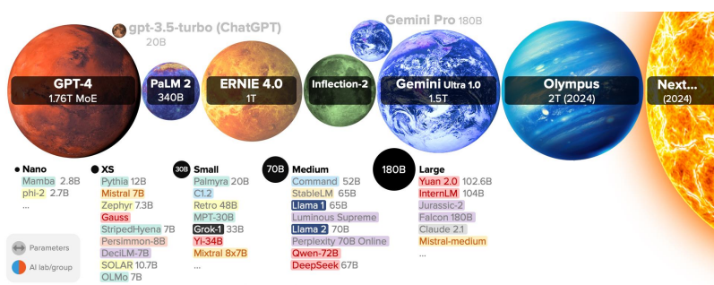

---

# LLM의 파라미터
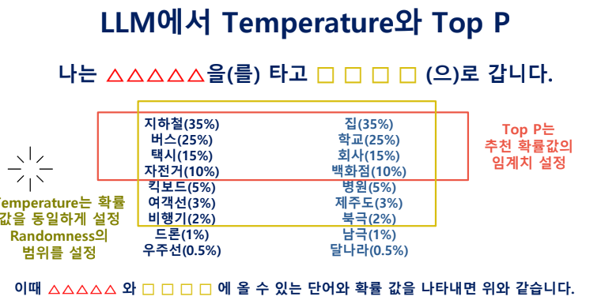
#### `temperature`
- 개념
    - 확률 내에 있는 후보들의 확률을 동일하게 하여, 그 중 선택되게 하는 것
    - 즉, **Temperature는 모델의 출력을 얼마나 "무작위"로 만들지를 조절하는 값**
- 범위
    - 0~2까지 있으며, 일반적으로 0에서 1 이상의 값을 가질 수 있습니다.
- 작동 방식
    - 낮은 값 (0.2 이하)
        - 예상 가능한 결과 값이 나올 확률이 높아짐. (일관성 향상)
        - 단, 답변의 유연성이 낮아질 수 있음
    - 높은 값 (0.8 이상)
        - 넓은 범위를 같은 확률로 추출하여 예상치 못한 값이 나올 확률이 높아짐. 
        - 창의적인 텍스트가 나올 수 있지만, 일관성이 떨어질 수 있음
#### `Top-P`
- 개념
    - 확률값을 제어할 수 있다. (ex. 확률이 10%이하인 것은 선택 대상에서 제외)
    - **단어를 선택할 때 확률이 높은 상위 p%의 단어들만 고려하도록 하는 방법**
- 범위
    - 0에서 1까지
- 작동방식
    - 낮은 값 (예: 0.1)
        - 가장 가능성이 높은 상위 10%의 단어들만 고려
        - 이로 인해 텍스트가 매우 제한적이지만, 일관성은 높음
    - 높은 값 (예: 0.9): 
        - 상위 90%의 단어들까지 고려되므로 더 많은 단어 선택이 가능
        - 결과적으로 텍스트가 더 다양하고 창의적

### 파라미터 별 비교 테스트
- temperature test
    ```python
    from openai import OpenAI
    client = OpenAI()

    prompt = "나는 출근할 때"
    response_low_temp = client.completions.create(
    model="gpt-3.5-turbo-instruct",
    prompt=prompt,
    temperature=0,
    max_tokens=256,
    top_p=1,
    frequency_penalty=0,
    presence_penalty=0
    )
    response_high_temp = client.completions.create(
    model="gpt-3.5-turbo-instruct",
    prompt=prompt,
    temperature=0.8,
    max_tokens=256,
    top_p=1,
    frequency_penalty=0,
    presence_penalty=0
    )

    print(f"#낮은 Temperature => {response_low_temp.choices[0].text}")
    print('====================================================')
    print(f"#높은 Temperature => {response_high_temp.choices[0].text}")
    ```
    temperature를 0과 0.8로 주고 각 테스트를 해보니 결과는 아래처럼 나왔다.
    ```
    #낮은 Temperature => 마다 이런 생각을 한다.

    "오늘도 열심히 일해야겠다."
    ====================================================
    #높은 Temperature => 마다 모르는 사이에 무언가가 변하는 것 같아요.

    그건 아마도 나무를 성장하는 것이 아닐까요? 식물들은 매일 다양한 환경 요인에 따라 성장하고 변화합니다. 그래서 출근할 때마다 조금씩 다른 모습을 보이는 것 같을 수 있어요. 그리고 나무는 우리가 생각하는 것보다 더 빠르게 성장하고 변화하기 때문에 더 눈에 띄게 느껴지는 것이죠. 나무의 성장과 변화는 우리에게 늘 새롭고 놀라운 경험이 될 수 있습니다. 그래서 출근할 때마다 나무를 관찰하며 그 변화를 지켜보는 것도 나쁘지 않을 것 
    ```

    낮은 Temperature의 경우 일반적인 답변이 나왔지만, 높은 Temperature의 경우 꽤 추상적인 답변이 나왔다.

- Top P 테스트
    ```python 
    from openai import OpenAI
    client = OpenAI()

    prompt = "흥미로운 이야기가 있어."
    response_low_topP = client.completions.create(
    model="gpt-3.5-turbo-instruct",
    prompt=prompt,
    temperature=0.2,
    max_tokens=256,
    top_p=0.1,
    frequency_penalty=0,
    presence_penalty=0
    )
    response_high_topP = client.completions.create(
    model="gpt-3.5-turbo-instruct",
    prompt=prompt,
    temperature=0.2,
    max_tokens=256,
    top_p=1,
    frequency_penalty=0,
    presence_penalty=0
    )

    print(f"#낮은 TopP => {response_low_topP.choices[0].text}")
    print('====================================================')
    print(f"#높은 TopP => {response_high_topP.choices[0].text}")
    ```

    결과는 다음과 같이 나왔다.
    ```
    #낮은 TopP => 

    그게 뭐야?

    그게 뭐냐면, 어제 친구들과 함께 여행을 갔는데 우리가 간 곳에는 유적지가 있었어. 그곳에서 우리는 역사적인 이야기를 들었는데, 그 중에 하나가 정말 흥미로웠어. 그곳에서 발견된 유물 중에는 100년 전에 만들어진 것도 있었는데, 그것을 보면서 우리는 그 시대의 사람들이 어떤 생활을 했는지 상상할 수 있었어. 그리고 그 유적지에서 발견된 문서들을 읽으면서 그들의 생각과 감정도 알 수 있었어. 정말 신기하고 재미있는 경험이었어.     
    ====================================================
    #높은 TopP =>

    그게 뭐야?

    그게 뭐냐면, 어제 나는 우연히 공원에서 노인들이 모여있는 모습을 보게 되었어. 그들은 서로 이야기를 나누고 웃으며 시간을 보내고 있었는데, 그 중 한 명의 노인이 나에게 다가와서 "젊은이야, 너도 우리와 함께 이야기 를 나누지 않겠니?"라고 물어보더라고. 나는 조금 부끄러웠지만 그들과 함께 이야기를 나누게 되었어. 그리고 그들이 나에게 전해준 많은 이야기들을 듣고 나서는 정말 감동받았어. 그들은 각자의 삶에서 겪은 다양한 경험들을 나누며 서로를
    ```

### 요약
- Temperature는 출력을 얼마나 무작위적으로 만들지 조절한다.
- Top-p는 가장 가능성이 높은 단어들 중에서 얼마나 많은 단어를 고려할지 결정한다.

---


# LLM과 InstructGPT의 차이

### instruct 모델 등장
Instruct 모델이란?
- 사람의 의도 알수 있도록 **강화 학습**된 모델

기존 chatGPT에 `instruct`가 추가되며 세간의 집중을 받게되었다.
- `gpt-3.5-turbo-instruct` 모델 등장!

사용자의 질문의 의도를 기존에 비해 더 잘 파악
- completion 모델을 통해 `대한민구의 수도는 어디에요?` 라는 질문으로 비교
- Base LLM : `davinci-002`로 테스트
    - 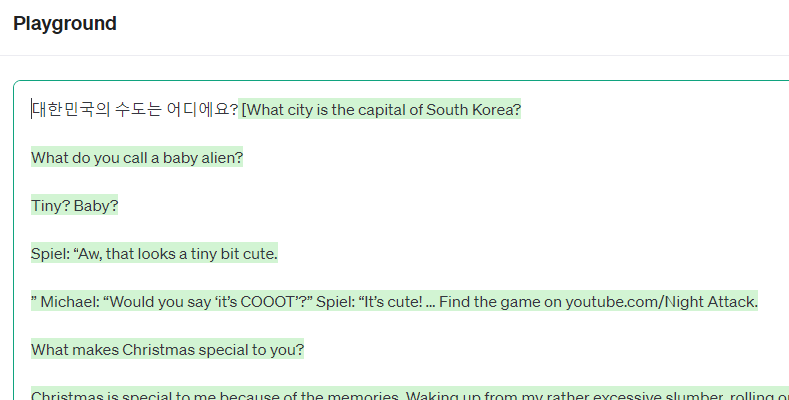
- Instruct LLM `gpt-3.5-turbo-instruct`로 테스트
    - 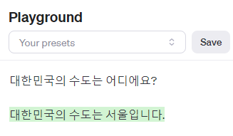

### instruct 학습 방법
어떻게 학습?

**[RLHF(Reinforcement Learning Human Feedback)](https://drive.google.com/file/d/1lUynjlMYPFcxT2NSSh-44V28Vxvx52vN/view?usp=sharing)** 학습
- 결과에 대해 Human feedback을 강화학습 시킨다. (어떤 결과에 대해 사람들이 선호하는지 알려주는 것)
- 예시
    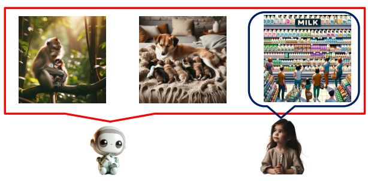

---

# chat 모델 과 completion 모델 차이

#### 각각 경험해보기
https://platform.openai.com/playground 에서 좌측 사이드바에서 `Chat`과 `Completions`를 선택해 테스트해볼 수 있다.
* 한국어 사용 시, Completions의 결과값이 너무 이상해서 영어로 테스트해보았다.

`I think` 입력
- Chat
    - 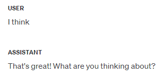
    - 대화를 시도한다.

- Completions
    - 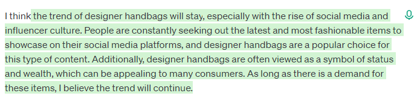
    - 문장을 이어서 완성해준다.

#### 기능 상 차이
Chat 모델과 Completion 모델은 모두 자연어 처리(NLP) 작업에 사용되는 언어 모델이지만, 그들의 사용 방식과 디자인 철학에는 중요한 차이가 있다.

##### Chat 모델
- 목적: 대화형 인터페이스
- 디자인: 대화의 문맥 유지 및 이해, 연속된 질문과 응답
- 사용 사례: 챗봇, 상호작용 응용 프로그램

##### Completaion 모델
- 목적: 단일 요청에 대한 텍스트 생성
- 디자인: 입력된 프롬프트에 기반한 텍스트 완성, 일회성이고 독립적인 질문과 응답 (이전 대화에 대한 문맥 유지 X)
- 사용 사례: 자동 글쓰기 보조, 코드 자동 완성, 간단한 질의

##### 예시
- Chat 모델

```plaintext
사용자: 오늘 날씨 어때?
모델: 오늘은 맑고 기온은 25도입니다.
사용자: 내일은?
모델: 내일은 비가 올 예정입니다.
```
이 경우, 모델은 첫 번째 질문 이후 두 번째 질문의 문맥을 유지한다.

- Completion 모델
```plaintext
프롬프트: 오늘 날씨 어때?
응답: 오늘은 맑고 기온은 25도입니다.

프롬프트: 내일 날씨는?
응답: 내일은 비가 올 예정입니다.
```
여기서 모델은 각각의 프롬프트에 대해 독립적으로 응답을 생성한다.

#### 코드 상의 차이
- 코드 예시
    - chat 모델
    ```python
    from openai import OpenAI
    client = OpenAI()

    response = client.chat.completions.create(
        model="gpt-4o",
        messages=[
            {
            "role": "system",
            "content": [
                {
                "type": "text",
                "text": "너는 아마도"
                }
            ]
            }
        ],
        temperature=1,
        max_tokens=256,
        top_p=1,
        frequency_penalty=0,
        presence_penalty=0
    )
    ```
    - completion 모델
    ```python
    from openai import OpenAI
    client = OpenAI()

    response = client.completions.create(
        model="gpt-3.5-turbo-instruct",
        prompt="너는 아마도",
        temperature=1,
        max_tokens=256,
        top_p=1,
        frequency_penalty=0,
        presence_penalty=0
    )
    ```
- 차이
    - 모델 호출 시, 호출하는 방법이 다르다.
        - chat: `client.chat.completions.create`
        - completion: `client.completions.create`
    - 메시지(프롬프트) 전달되는 부분이 다르다.
        - chat: `message`를 통해 전달 - role/content(type/text)가 리스트로 전달
        - completion: `prompt`를 통해 전달 - 단일 텍스트
- **model을 선택할 때, completion 모델과 chat 모델을 같은 파라미터값으로 사용한다면 오류가 발생하기에 유의해야한다!**

---

# Embedding & 유사도 검색

### 맥락을 이해하는 인공지능
- 주어진 정보를 가지고, 전후 맥락을 파악하여 단어나 문장이 사용된 전체 문장이나 문단의 정보를 고려하여 정확한 의미를 도출
- 맥락은 "인공지능이 <mark>더 정확하고 인간처럼 복잡한 판단</mark>을 내릴 수 있게 도와주는 핵심요소"

- 먹는 `배`와 타는 `배`를 맥락을 통해 구분
    - 먹는 배로 인식
    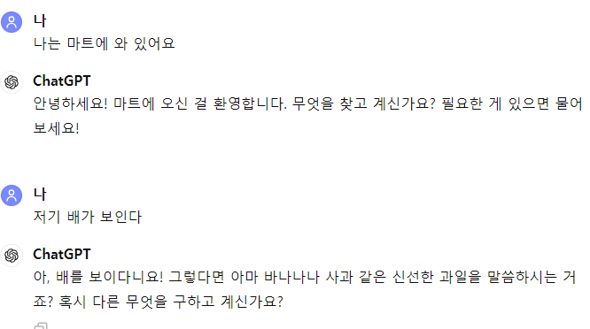
    - 타는 배로 인식
    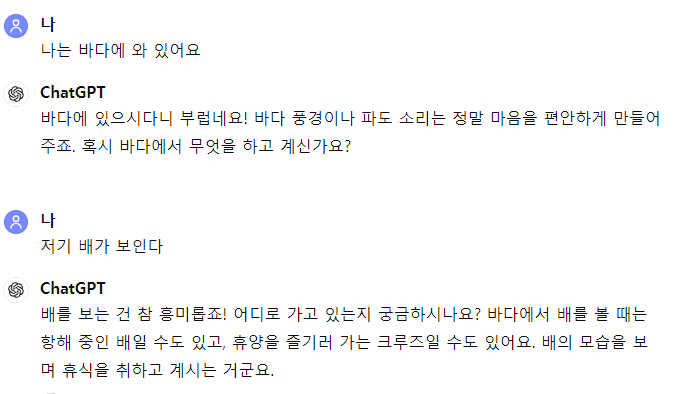
    - => 마트에 있다면 먹는 배로, 바다에 있다면 타는 배로 맥락을 통한 해석을 한다.


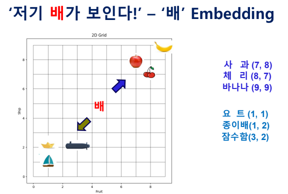
각 특성들에 따라 과일들이 각 임베딩 되어있고, 해양 이동수단들이 각 임베딩 되어있다.
이때 아직은 `배`가 과일을 의미하는지, 탈 것을 의미하는지 구분하기 어렵다.
`배`가 맥락에 따라 임베딩된 값을 가지고 어떤 것을 의미하는지 맥락을 확인하는 방법이 유사도 검색이다.

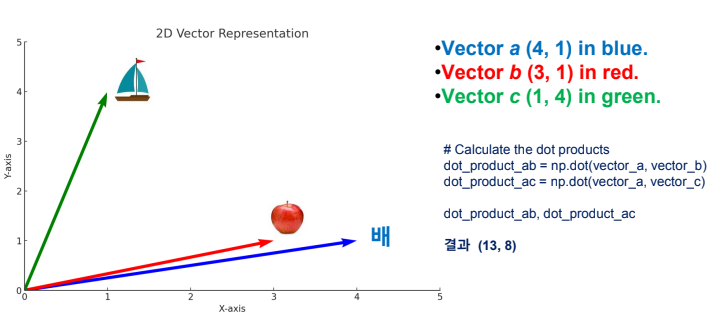
요트의 벡터값은 (1, 4)이고, 사과의 벡터값은 (3, 1)이다.
이때 입력된 배의 벡터값이 (4, 1)일 때 우리는 입력된 배가 사과가 더 유사하고, 그렇기에 입력된 배는 과일 배를 의미함을 알 수 있다.

이 때 각 벡터의 거리값을 계산하는 것이 유사도 검색이다. 유사도 검색 방법은 여러 가지가 있다.
- 코사인 유사도 검색
- 유클리드 검색
- 등등
---

