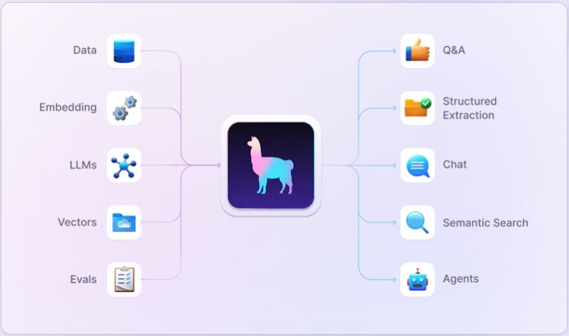

---

# Llamaindex

### LlamaIndex 컨셉

- LlamaIndex는 대규모 언어 모델 (LLM) 어플리케이션 개발을 용이하게 하는 종합적인 "데이터 프레임워크"
- 공식 사이트: https://www.llamaindex.ai/

LlamaIndex은 LLM 어플리케이션 구현을 위해 필요한 과정인 Data Loading, Embedding, LLM, Vector DB 등의 역할을 간단하게 구현해줄 수 있다.
(물론 부분적으로 사용도 가능하다. 예를 들어 Data Loading은 별도 모듈을 사용하고, 나머지 부분만 LlamaIndex를 사용하는 등의 커스터 마이징이 가능하다.)

또한 다른 프레임워크와의 통합이 유연하다.
LangChain, Flask, Docker, ChatGPT 및 프로젝트에 필요한 다른 도구와 함께 사용할 수 있다.

### LlamaIndex 도구

LlamaIndex에서 제공해주는 도구를 자세히 보자.
#### Loading
- LLM 애플리케이션과 함께 사용하기 위해 API, PDF, SQL, NoSQL, 문서 등과 같은 기존 데이터를 수집하고 통합할 수 있다. (160여개 이상의 데이터 소스와 포맷을 지원한다.)
- 이를 통해 다양한 형식의 데이터를 하나의 일관된 인덱스로 구성할 수 있다.

#### Indexing
- 데이터를 효율적으로 검색할 수 있도록 인덱싱하고, 저장한다.
- 40여개 이상의 벡터 스토어, 문서 스토어, 그래프 스토어, SQL DB provider를 통합하였다.

#### Query
- 데이터 원천소스를 기반으로 프롬프트 체인으로부터 고급 agent까지 LLM의 workflow를 통합하고 자동화해준다.

#### Evaluating
- 모듈과의 적합도를 기반으로 성능을 평가한다.

### LlamIndex 간단 코드 예제
벡터 저장소 인덱스를 빌드하고 쿼리하는 간단한 예제

```python
import os
os.environ["OPENAI_API_KEY"] = '당신의_OPENAI_API_키'
 
from llama_index import GPTVectorStoreIndex, SimpleDirectoryReader
documents = SimpleDirectoryReader('data').load_data()
index = GPTVectorStoreIndex.from_documents(documents)
 
# 검색 쿼리:
query_engine = index.as_query_engine()
query_engine.query("<질문_텍스트>?")
 
# 기본적으로, 데이터는 메모리에 저장됩니다. 디스크에 저장하려면 (./storage 이하):
index.storage_context.persist()
 
# 재로드:
_from_storage
# 저장 컨텍스트 다시 구성
storage_context = StorageContext.from_defaults(persist_dir='./storage')
# 인덱스 로드
index = load_index_from_storage(storage_context)
```

### 랭체인의 Agent과 결합한 코드 예제
- 라마인덱스를 통해 **데이터 로딩, text split(chunk나누기), embedding, vector store**를 구현
- Langchain에서 라마인덱스를 활용한 방법 예제
    - 라마인덱스를 툴로 할당
    - 에이전트에서 생성한 라마인덱스 툴을 활용하는 RAG 질의 어플리케이션
```python
# Using LlamaIndex as a Callable Tool
from langchain.agents import Tool
from langchain.chains.conversation.memory import ConversationBufferMemory
from langchain.chat_models import ChatOpenAI
from langchain.agents import initialize_agent

from llama_index.core import VectorStoreIndex, SimpleDirectoryReader

documents = SimpleDirectoryReader("./data").load_data()
index = VectorStoreIndex.from_documents(documents=documents)

# Tool 생성
tools = [
    Tool(
        name="LlamaIndex",
        func=lambda q: str(index.as_query_engine().query(q)),
        description=u"seful for when you want to answer questions about the author. The input to this tool should be a complete english sentence.",
        return_direct=True,
    )
]

# 메모리 생성
memory = ConversationBufferMemory(memory_key="chat_history")

# llm 초기화
llm = ChatOpenAI(temperature=0)

# agent 초기화
agent_executor = initialize_agent(
    tools,
    llm,
    agent="conversational-react-description",
    memory=memory
)

```

- `data` 하위에 에세이 텍스트 파일 저장
- `SimpleDirectoryReader("./data").load_data()`
    - 데이터 로드
- `VectorStoreIndex.from_documents(documents=documents)`
    - 로딩된 원본 데이터를 벡터 스토어에 저장
    - 문서들을 벡터화하여 검색 가능한 형태로 준비
- `tools`: agent의 툴 목록에 LlamaIndex 툴 생성 (Tool 객체를 생성하여 LlamaIndex라는 도구를 정의)
    - `func=lambda q: str(index.as_query_engine().query(q))`
        - 생성한 벡터 스토어를 통해 검색하는 작업을 func에 선언
        - 입력된 질문(q)에 대한 답변을 생성
        - 이 함수는 llama_index에서 제공하는 쿼리 엔진을 사용하여 문서에서 질문에 맞는 정보를 검색
- `ConversationBufferMemory `
    - 대화 히스토리를 관리하는 메모리를 설정
    - 메모리는 대화의 문맥을 유지하고, 사용자와 시스템 간의 대화 흐름을 추적하는 데 사용
- `initialize_agent`
    - LlamaIndex 도구와 ChatOpenAI 모델, 그리고 대화 히스토리를 포함한 전체적인 대화 에이전트를 설정

- 결과
```python
print(f'#### 답변 => {agent_executor.run(input="who is the author of this document?")}')
# Paul Graham
print(f'#### 답변 => {agent_executor.run(input="please summarize the document")}')
# The document describes the author's experiences as an art student at RISD, 
# his time working at Interleaf, and his eventual retu...(생략)
print(f'#### 답변 => {agent_executor.run(input="please summarize the document in Korean")}')
# 이 문서는 Y Combinator 창립자인 폴 그레이엄의 이야기를 담고 있습니다. 
# 그는 Y Combinator를 다른 사람에게 맡기기로 결정하고 회사를 떠나기로 했으며, 
# 이후 회사의 새로운 리더로 삼 알트만을 모집하고자 했습니다. (생략)
```
- 로딩된 문서를 기반하여 답을 잘 생성해준다.


