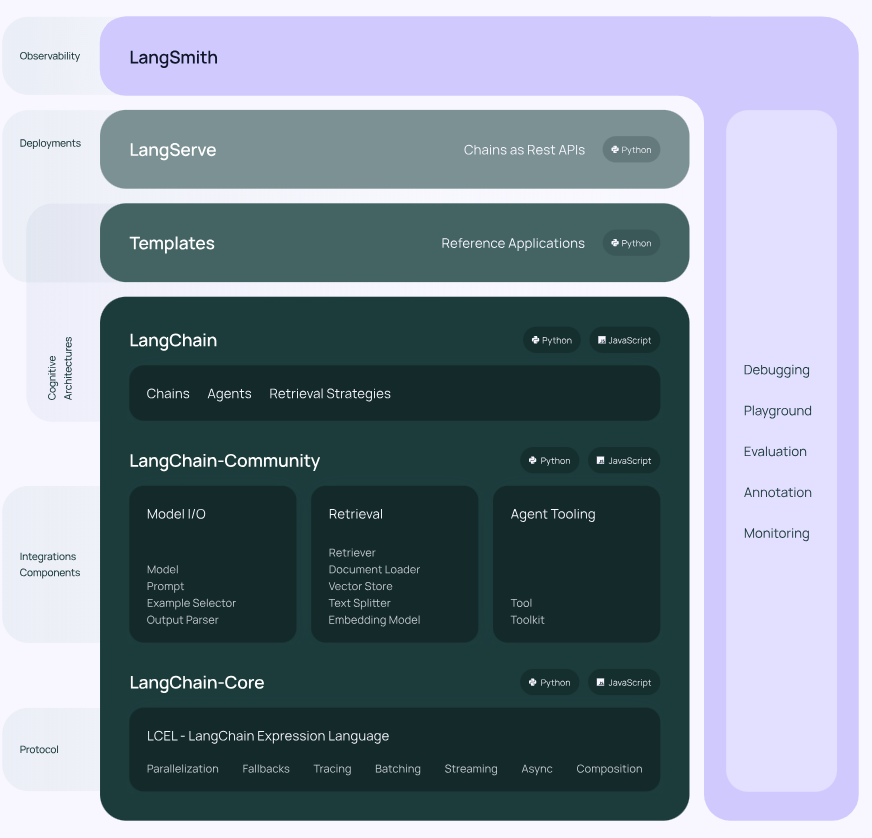
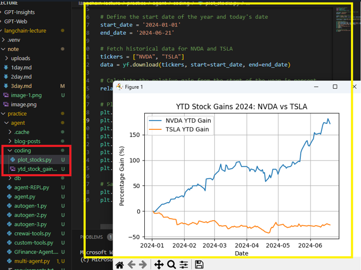

# Langchain



### Concept
- Langchain-Core
    - LCEL
- Langchain-Community
    - Model I/O
    - Retireval
    - Agent Tooling
- Langchain
    - Chains / Agents / Retrieval Strategies

### v1 vs v2
- Tool이 v2에서 deprecated됨 (v1에서 존재)
- concept이 변경되어서!

---

# Agent

### Agent 구성 종류
- 한 개의 Agent가 멀티 툴을 이용하여 작업
- 여러 개의 Agent를 연동하여 수행하는 작업

### AOP(Agent-Oriented Programming) 프레임워크 종류
- [LangChain의 Agent](https://python.langchain.com/v0.1/docs/modules/agents/)
- [crewAI](crewai.com)
- [AutoGen](https://microsoft.github.io/autogen/) 

### 프레임워크 별 멀티 에이전트를 구현하는 방법 차이
##### LangChain LangGraph
- 그래프 기반의 구조
- Agent들끼리 Tool을 서로 공유하게 한다.
- Agent 간의 상호 작용 / 협업을 가능케한다.
- 구성 요소
    - `에이전트(Agents)`: 특정 작업을 수행하는 독립된 실행 단위입니다. 각 에이전트는 특정 역할이나 기능을 담당합니다.
    - `노드(Nodes)`: 각 에이전트가 속한 그래프의 노드로, 에이전트 간의 관계와 상호작용을 정의합니다.
    - `엣지(Edges)`: 노드 간의 연결로, 에이전트 간의 의사소통 경로를 나타냅니다.
    - `작업(Task)`: 에이전트가 수행해야 할 작업으로, 그래프 구조 내에서 분배되고 관리됩니다.


#### CrewAI
- 여러 에이전트가 팀(크루)을 이루어 작업 수행하도록 한다.
- 각 에이전트는 독립적으로 작동하지만, 협력과 조율을 통해 복잡한 작업을 효율적으로 처리
- 각 에이전트 별로 Tool을 지정하여 역할을 픽스한다.
- 구성 요소
    - `에이전트(Agents)`: 특정 역할과 작업을 수행하는 독립된 실행 단위입니다. 각 에이전트는 자신만의 특성과 기능을 가지고 있습니다.
    - `팀(Teams)`: 여러 에이전트가 모여 하나의 팀을 이루며, 협력하여 작업을 수행합니다.
    - `조율기(Coordinator)`: 팀 내 에이전트 간의 상호작용과 협업을 조율하고 관리합니다.
    - `작업(Task)`: 에이전트가 수행해야 할 작업으로, 팀 단위로 분배되고 처리됩니다.
##### 예제
- **시나리오**
    - 에이전트1: 시장조사 분석가 
        - 목표: AI 산업의 향후 분석 제공 
        - 백스토리: 시장 트렌드에 대한 전문가
        - 툴: search_tool, web_rag_tool 이용
    - 에이전트2: 콘텐츠 작가
        - 목표:AI 산업에 대한 블로그 초안 작성
        - 백스토리: 기술에 대한 열정이 있는 기술력있는 작가
        - 툴:docs_tool, file_tool
    - Task1: AI 산업의 최신 트렌드 요약 검색
        - 에이전트: `에이전트1: 시장조사 분석가`
    - Task2: AI 산업에 대한 블로그 포스트를 작성해서, 파일로 저장
        - 에이전트: `에이전트2: 콘텐츠 작가`

    <details>
    <summary>구현 코드</summary>

    ```python
    import os
    from crewai import Agent, Task, Crew
    # Importing crewAI tools
    from crewai_tools import (
        DirectoryReadTool,
        FileReadTool,
        SerperDevTool,
        WebsiteSearchTool
    )

    # Set up API keys
    os.environ["SERPER_API_KEY"] = "Your Key" # serper.dev API key
    os.environ["OPENAI_API_KEY"] = "Your Key"

    # Instantiate tools
    docs_tool = DirectoryReadTool(directory='./blog-posts')
    file_tool = FileReadTool()
    search_tool = SerperDevTool()
    web_rag_tool = WebsiteSearchTool()

    # Create agents
    researcher = Agent(
        role='Market Research Analyst',
        goal='Provide up-to-date market analysis of the AI industry',
        backstory='An expert analyst with a keen eye for market trends.',
        tools=[search_tool, web_rag_tool],
        verbose=True
    )

    writer = Agent(
        role='Content Writer',
        goal='Craft engaging blog posts about the AI industry',
        backstory='A skilled writer with a passion for technology.',
        tools=[docs_tool, file_tool],
        verbose=True
    )

    # Define tasks
    research = Task(
        description='Research the latest trends in the AI industry and provide a summary.',
        expected_output='A summary of the top 3 trending developments in the AI industry with a unique perspective on their significance.',
        agent=researcher
    )

    write = Task(
        description='Write an engaging blog post about the AI industry, based on the research analyst’s summary. Draw inspiration from the latest blog posts in the directory.',
        expected_output='A 4-paragraph blog post formatted in markdown with engaging, informative, and accessible content, avoiding complex jargon.',
        agent=writer,
        output_file='blog-posts/new_post.md'  # The final blog post will be saved here
    )

    # Assemble a crew
    crew = Crew(
        agents=[researcher, writer],
        tasks=[research, write],
        verbose=2
    )

    # Execute tasks
    crew.kickoff()
    ```
    </details>

    <details>
    <summary>코드 실행 결과</summary>

    ```markdown
    # The AI Revolution of 2023: Trends Shaping Our Future

    2023 has been a landmark year for the AI industry, marked by significant advancements and transformative trends. Among the most notable developments are the rise of Generative AI and Large Language Models (LLMs), groundbreaking applications of AI in healthcare, and an increased focus on ethical AI and regulation. These trends collectively promise to shape a future where AI is seamlessly integrated into our daily lives, enhancing human capabilities while addressing new ethical and regulatory challenges.

    ## Generative AI and Large Language Models

    Generative AI, particularly Large Language Models like OpenAI's GPT-4 and Google's LaMDA, continues to dominate the AI landscape. These models have become incredibly adept at understanding and generating human-like text, revolutionizing industries such as content creation, customer service, and education. The significance of this trend lies in its potential to make human-computer interactions more intuitive and accessible, paving the way for a future where technology seamlessly integrates into our daily routines.

    ## AI in Healthcare

    The application of AI in healthcare has seen remarkable advancements in 2023, particularly in predictive analytics, personalized medicine, and diagnostic imaging. AI algorithms now excel at predicting patient outcomes, tailoring treatments to individual genetic profiles, and identifying diseases from medical images with unprecedented accuracy. This trend promises to enhance patient care, reduce healthcare costs, and address the challenges posed by an aging population. The integration of AI in healthcare is not just a technological shift but a profound leap towards a more efficient and effective healthcare system.

    ## Ethical AI and Regulation

    As AI technologies rapidly advance, the ethical implications and the need for regulation have become more pressing. Issues such as data privacy, algorithmic bias, and the potential misuse of AI are central topics of discussion in 2023. Governments and organizations worldwide are implementing policies and frameworks to ensure the responsible development and deployment of AI. This trend underscores the importance of balancing innovation with societal impact, ensuring that AI technologies are developed and used in ways that are fair, transparent, and beneficial to all.

    In conclusion, the trends in Generative AI, healthcare applications, and ethical AI are collectively shaping a future where AI enhances human capabilities while addressing critical ethical and regulatory challenges. By balancing innovation with responsibility, we can harness the full potential of AI, driving progress and ensuring public trust and equity in this transformative era.
    ```

    </details>


#### AutoGen
- 자동화된 에이전트 생성 및 관리를 위한 프레임워크 => 에이전트를 자동으로 생성 & 관리에 중점
- 사용자가 명시한 요구 사항에 따라 자동으로 에이전트를 생성하고 배포
- AutoGen의 에이전트 종류
    - Conversational Agent:
        - 역할: 대화에 참여하고 질문에 답하며 정보를 제공합니다.
        - 권한: 사전 정의된 대화 패턴과 주제 내에서 활동합니다.
    - Assistant Agent:
        - 역할: 작업을 수행하고 LLM과 도구를 활용하여 사용자를 돕습니다.
        - 권한: 복잡한 워크플로를 실행하고 작업 완료를 위해 도구를 사용합니다.
    - UserProxy Agent:
        - 역할: 사용자를 대신하여 작업을 시작하고 상호작용을 수행합니다.
        - 권한: 사용자와 다른 에이전트 간의 통신을 촉진하고 도구 사용 및 작업 위임을 처리합니다.
- 에이전트의 구분 기분
    - 코드 실행 가능 여부
        - 실행O: UserProxy Agent (실행 환경은 로컬 혹은 docker 중 선택 가능)
        - 실행X: Assistant Agent

##### `Conversational Agent` 예제 1
- **시나리오**
    - 코미디언 joe(aka 멍멍님)와 cathy(aka 야옹님)의 만담

    <details>
    <summary>구현 코드</summary>

    ```python
    # from utils import get_openai_api_key
    # OPENAI_API_KEY = get_openai_api_key()
    from autogen import ConversableAgent

    llm_config = {"model": "gpt-3.5-turbo"}

    # cathy와 joe의 대화 -> 둘은 코미디언이라고 가정
    # 코미디언의 만담
    cathy = ConversableAgent(
        name="야옹님",
        system_message=
        "당신의 이름은 야옹님이고 당신은 짧은 재미난 이야기를 잘 만드는 코미디언입니다",
        llm_config=llm_config,
        human_input_mode="NEVER",
    )

    joe = ConversableAgent(
        name="멍멍님",
        system_message=
        "당신의 이름은 멍멍님이고 당신은 짧은 재미난 이야기를 잘 만드는 코미디언입니다"
        "이전 대화의 내용을 이어서 다음 재미난 이야기를 시작하세요.",
        llm_config=llm_config,
        human_input_mode="NEVER",
    )

    # joe부터 시작
    chat_result = joe.initiate_chat(
        recipient=cathy,
        message="나는 야옹님이야, 우리 재미난 이야기를 이어서 나가 볼까?",
        max_turns=2, # 둘의 대화는 2번 반복
    )

    ```
    </details>

    <details>
    <summary>코드 실행 결과</summary>

    ```commandline
    멍멍님 (to 야옹님):

    나는 야옹님이야, 우리 재미난 이야기를 이어서 나가 볼까?

    --------------------------------------------------------------------------------
    야옹님 (to 멍멍님):

    물론이죠! 한 번 시작해볼까요?

    한 번 천지에 호랑이가 나타났대요. 왜냐면 호랑이가 택배를 배달하는데, 라이언이라고 하는 친구는 주소를 잘 못 보내서... 호랑이가 찾아온 거래요. (하하)

    계속해나갈까요?

    --------------------------------------------------------------------------------
    멍멍님 (to 야옹님):

    그런데 호랑이는 택배를 전해주려고 하는데 주소를 정말 잘못 보냈어요. 그래서 택배를 받을 사람이 호랑이 발밑에 숨어있었답니다! 호랑이는 주소를 확인할 때마다 발밑을 한 번 더 쳐다보게 되었어요. 그 결과, 택배를 받을 사람은 호랑이 한 발짝 더 가까이 다가가기를 기대했지만, 계속해서 탐탁지 않은 시선을 받았답니다. 호랑이와 택배를 받을 사람 간의 웃긴 대치가 벌어지기 시작했어요.

    어떤 결말이 될지 궁금하죠? 계속해보시죠!

    --------------------------------------------------------------------------------
    야옹님 (to 멍멍님):

    그러자 택배를 받을 사람이 호랑이를 놀리기로 마음먹었어요. 호랑이가 발밑을 한 번 더 쳐다볼 때마다, 택배를 받을 사람은 한층 더 발밑에 숨어서 호랑이를 놀래키는  찰나를 노렸죠.

    그리고 마침내 호랑이가 발밑에 누군가 있다는 것을 이해하고, 신문지를 덮어두고 있는 택배를 받을 사람은 호랑이 뒤에서 숨어서 "우와! 누가 넌지나는 거야?"라고 소리치면서 호랑이를 놀래키기로 했답니다.

    대미를 앞둔 호랑이와 택배를 받을 사람 사이의 유쾌한 대결, 그 끝은 과연 어떻게  될지 모르겠네요! 그럼 어떻게 해야 할지, 여러분들은 어떻게 생각하시나요? 함께 이어가보세요!

    --------------------------------------------------------------------------------
    ```
    </details>

##### 예제 2 
- **시나리오**
    - NVDA와 TSLA의 주가를 비교하여 표를 이미지로 만드는 python코드를 작성하고, 작성한 코드를 실행해서 이미지를 로컬에 저장하기

    <details>
    <summary>구현 코드</summary>

    ```python

    from autogen.coding import LocalCommandLineCodeExecutor
    from autogen import ConversableAgent, AssistantAgent
    import datetime


    llm_config = {"model": "gpt-4-turbo"}

    # code executor 정의
    executor = LocalCommandLineCodeExecutor(
        timeout=60,
        work_dir="coding", # coding 디렉토리에 코드 생성 후 실행
    )

    # agent 생성
    # code executor config Agent 
    code_executor_agent = ConversableAgent(
        name="code_executor_agent",
        llm_config=False,
        code_execution_config={"executor": executor},
        human_input_mode="NEVER",
        default_auto_reply=
        "Please continue. If everything is done, reply 'TERMINATE'.",
    )
    # code wirter Agent
    code_writer_agent = AssistantAgent(
        name="code_writer_agent",
        llm_config=llm_config,
        code_execution_config=False,
        human_input_mode="NEVER",
    )
    # 코드 생성 프롬프트
    code_writer_agent_system_message = code_writer_agent.system_message
    # print(code_writer_agent_system_message)
    # You are a helpful AI assistant.
    # Solve tasks using your coding and language skills.
    # In the following cases, suggest python code (in a python coding block) or shell script (in a sh coding block) for the user to execute.
    #     1. When you need to collect info, use the code to output the info you need, for example, browse or search the web, download/read a file, print the content of a webpage or a file, get the current date/time, check the operating system. After sufficient info is printed and the task is ready to be solved based on your language skill, you can solve the task by yourself.
    #     2. When you need to perform some task with code, use the code to perform the task and output the result. Finish the task smartly.
    # ..(생략)..
    # Reply "TERMINATE" in the end when everything is done.

    # Task 정의
    today = datetime.datetime.now().date()
    message = f"Today is {today}. "\
    "Create a plot showing stock gain YTD for NVDA and TLSA. "\
    "Make sure the code is in markdown code block and save the figure"\
    " to a file ytd_stock_gains.png."""

    # 코드 실행 에이전트를 통해 실행
    chat_result = code_executor_agent.initiate_chat(
        code_writer_agent,
        message=message
    )
    ```
    </details>

    <details>
    <summary>코드 실행 결과</summary>

    ```commandline
    code_executor_agent (to code_writer_agent):

    Today is 2024-06-21. Create a plot showing stock gain YTD for NVDA and TLSA. Make sure the code is in markdown code block and save the figure to a file ytd_stock_gains.png.

    --------------------------------------------------------------------------------
    code_writer_agent (to code_executor_agent):

    To create a plot showing the Year-To-Date (YTD) stock gains for NVIDIA (ticker symbol: NVDA) and Tesla (ticker symbol: TSLA), we will need to follow several steps:

    1. Fetch the stock data for NVDA and TSLA starting from January 1, 2024, to today (June 21, 2024).
    2. Calculate the percentage gain YTD for each stock.
    3. Plot these gains on a chart.
    4. Save the plot to a file named `ytd_stock_gains.png`.

    Using Python, we can complete these tasks using libraries such as `pandas` for data manipulation and `yfinance` to fetch historical stock data. We'll plot the data using `matplotlib`.

    Here is the complete python script you will execute:

    ```python
    # filename: plot_stocks.py
    import yfinance as yf
    import pandas as pd
    import matplotlib.pyplot as plt

    # Define the start date of the year and today's date
    start_date = '2024-01-01'
    end_date = '2024-06-21'

    # Fetch historical data for NVDA and TSLA
    tickers = ["NVDA", "TSLA"]
    data = yf.download(tickers, start=start_date, end=end_date)

    # Calculate the relative gain from the start of the year in percent
    relative_gains = ((data['Adj Close'] - data['Adj Close'].iloc[0]) / data['Adj Close'].iloc[0]) * 100

    # Plotting the results
    plt.figure(figsize=(10, 6))
    plt.plot(relative_gains.index, relative_gains['NVDA'], label='NVDA YTD Gain')  
    plt.plot(relative_gains.index, relative_gains['TSLA'], label='TSLA YTD Gain')  
    plt.title('YTD Stock Gains 2024: NVDA vs TSLA')
    plt.xlabel('Date')
    plt.ylabel('Percentage Gain (%)')
    plt.legend()
    plt.grid(True)

    # Save the plot to a file
    plt.savefig('ytd_stock_gains.png')
    plt.show()
    ```

    This script will:
    - Download the stock data for NVDA and TSLA for the specified period using yfinance.
    - Calculate the percentage gain using the adjusted close prices.
    - Plot these gains and save the resulting plot to `ytd_stock_gains.png`.       

    Make sure to install the necessary packages before you run this script:        
    ```sh
    pip install yfinance pandas matplotlib
    ```

    Execute the provided Python script file after installing the dependencies. It will automatically generate and display the plot, as well as save it to `ytd_stock_gains.png`.

    --------------------------------------------------------------------------------
    ```

    또한 coding 디렉토리 내에 표를 만드는 python코드와 그래프 이미지가 저장되었다.
    


    </details>


---
`CrewIO`의 시나리오와 코드를 보면 제가 가상의 팀을 구성해서, 팀리더가 된 기분이 듭니다.
실제로 전문가들을 고용하고 일을 지시할 필요 없이 저렇게 코드로 만들고, `넌 이거고 이거해` 라고 하니 알아서 작업을 수행해준다는 것이 너무 신기하네요!!

`AutoGen`에서는 코딩을 하는 Agent도 만들어보았는데요.. 똑똑하게 잘하네요 😂

---

- Agent 종류
    - 코드 미실행
    - 코드 실행
        - PC 서버에서 실행
        - 컨테이너 내 실행 (✅권장되는 방법)
---

# LangGraph

- Agent를 통제(추적)하는 수단 중 하나!


---

# LangSmith

- Langchain agent 내부 동작 구조 이해
- Agent에서 수행되는 task를 추적하고 단계 별 task의 수행 작업을 확인하는 프레임워크

---
